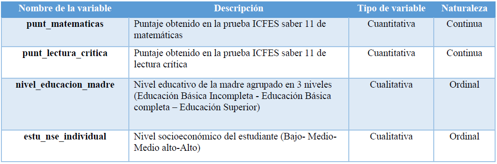
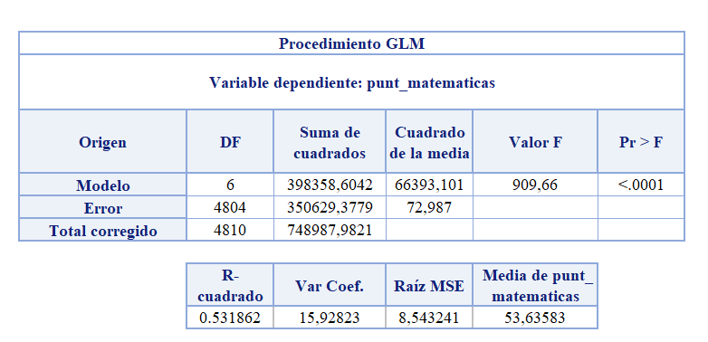
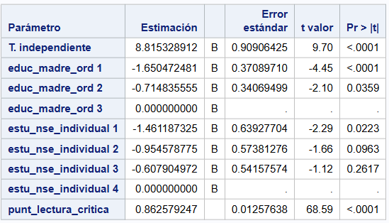
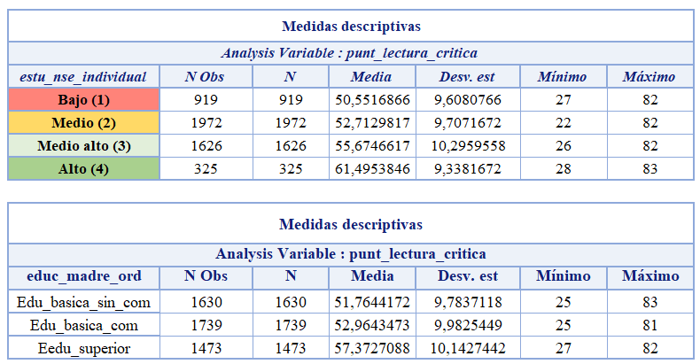
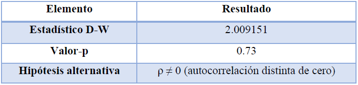
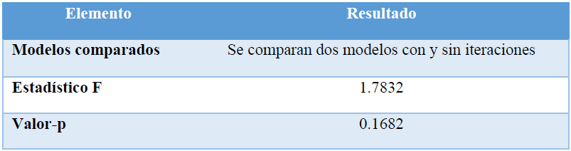
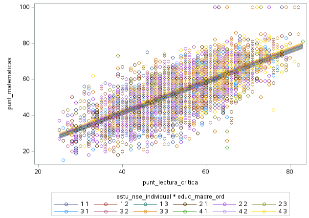
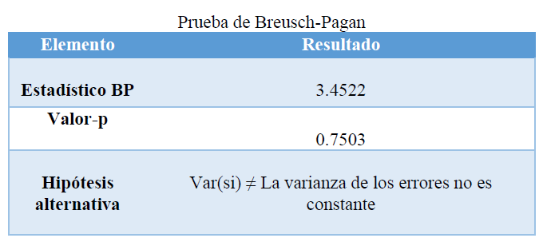
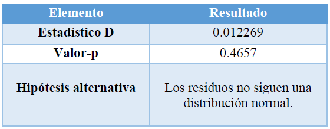
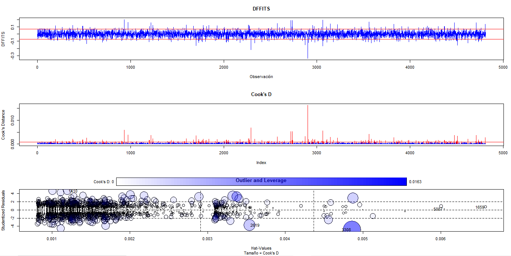

```{r,echo=FALSE, include=FALSE}
library(dplyr)
library(readxl)
library(ggplot2)
library(GGally)
library(RcmdrMisc)
library(car)
library(tidyverse)
library(modelr)
library(devtools)
library(conflicted)
library(MASS)
library(effects)
library(nortest)
library(DescTools)
library(lmtest)
library(MASS)
library(sjPlot)
library(olsrr)

homoceda <- readRDS(file = "homoceda.rds")
Hist_residuales <- readRDS(file = "Hist_residuales.rds")
Q_Q <- readRDS(file = "Q_Q.rds")
lineal <- readRDS(file = "lineal.rds")

```

## Introducción

En el ámbito educativo, la evaluación del rendimiento académico de los estudiantes ha sido objeto de numerosos estudios a nivel nacional e internacional, especialmente en las áreas de ciencias naturales, matemáticas y lenguaje. Diversas investigaciones el género del estudiante pueden influir significativamente en los resultados obtenidos por los alumnos en pruebas estandarizadas.

El presente análisis se enmarca en este contexto y utiliza como fuente la base de datos del Instituto Colombiano para la Evaluación de la Educación (ICFES) correspondiente al segundo semestre del año 2024 2. La muestra analizada se restringe al departamento de Casanare, lo cual permite enfocar el estudio en una región específica del país y observar sus características particulares.

## Objetivo general

Analizar el efecto del nivel educativo de la madre y del nivel socioeconómico del estudiante sobre el puntaje en matemáticas , controlando la influencia del puntaje en lectura crítica como covariable.

-   Estimar el efecto del nivel educativo de la madre y del nivel socioeconómico sobre el rendimiento en matemáticas, ajustando por el puntaje en lectura crítica.

-   Evaluar si el puntaje en lectura crítica se asocia significativamente con el puntaje en matemáticas, cuando se controlan los efectos del nivel educativo de la madre y el nivel socioeconómico.

-   Determinar si existen diferencias significativas en el puntaje en matemáticas entre los distintos niveles educativos de la madre y niveles socioeconómicos, ajustando por la covariable.

## Datos

La base de datos utilizada en este estudio proviene del ICFES y corresponde a los resultados de las pruebas estandarizadas aplicadas en el periodo $2024-2$. La muestra se limita a un total de 5465 estudiantes del departamento de Casanare (Colombia), y contiene información relevante para el análisis del rendimiento académico en
matemáticas, así como variables asociadas a características individuales y del entorno familiar del estudiante.

```{r, fig.pos="h", out.width="70%", fig.cap="Tabla de variables", echo=FALSE}

```

El procedimiento estadístico utilizado para analizar el efecto de dos factores categóricos y una covariable continua
sobre el desempeño académico en matemáticas de estudiantes de educación media. Para tal fin, se implementó un
modelo de análisis de covarianza, que permite comparar las medias ajustadas del puntaje en matemáticas entre
grupos definidos por el nivel educativo de la madre y el nivel socioeconómico del estudiante, controlando el efecto
del puntaje en lectura crítica como covariable.

Este diseño permite evaluar si existen diferencias significativas en el rendimiento en matemáticas atribuibles a las
condiciones socioculturales y económicas del entorno familiar, una vez que se ha ajustado estadísticamente el efecto
del desempeño en lectura crítica.

## Métodos

La formulación general del modelo se expresa de la siguiente manera:

\[Y_{ijk} = \mu + \alpha_i + \beta_j + (\alpha\beta)_{ij} + \gamma X_k + \epsilon_{ijk}\]

Explicación de Términos

| Símbolo          | Descripción                                                                 |
|------------------|-----------------------------------------------------------------------------|
| $Y_{ijk}$        | Variable respuesta (ej: puntaje en matemáticas).                           |
| $\mu$            | Media global del modelo.                                                   |
| $\alpha_i$       | Efecto del $i$-ésimo nivel del **primer factor categórico** (ej: Grupo).  |
| $\beta_j$        | Efecto del $j$-ésimo nivel del **segundo factor categórico** (ej: Tratamiento). |
| $(\alpha\beta)_{ij}$ | Interacción entre los dos factores.                                  |
| $\gamma X_k$     | Efecto de la **covariable continua** $X_k$ (ej: Edad).                     |
| $\epsilon_{ijk}$ | Error aleatorio $\sim N(0, \sigma^2)$.     

*Supuestos del Modelo ANCOVA*

Para que las inferencias del modelo sean válidas y robustas , deben cumplirse los
siguientes supuestos estadísticos:

- Independencia de las observaciones: los estudiantes son unidades estadísticas independientes.

- Relación lineal entre la covariable y la variable dependiente: se asume que existe una relación lineal entre
el puntaje en lectura crítica y el puntaje en matemáticas.

- Homogeneidad de pendientes: la relación entre la covariable y la variable respuesta es constante en todos
los niveles de los factores.

- Homocedasticidad: se espera varianza constante de los errores en los distintos grupos.

- Normalidad de los errores residuales: los residuos del modelo deben seguir una distribución normal.

# Análisis Diagnóstico del Modelo

Ante la diversidad de variables disponibles como posibles predictores, se implementó un
a estrategia metodológica para identificar el conjunto óptimo de variables. Este enfoque buscará equilibrar la capacidad predictiva del modelo más simple y con el menor número de supuestos (principio de parsimonia), garantizando así un modelo robusto e interpretable.

Una vez ajustado el modelo se procede a realizar un conjunto de análisis diagnósticos con el fin de evaluar su
validez estadística y asegurar la fiabilidad de las inferencias.
# Software
- SAS (versión 9.4): utilizado para el preprocesamiento de datos, recodificación de variables, análisis
descriptivo y ejecución del modelo ANCOVA.

- RStudio (versión 2024.03.0): se empleó de forma complementaria para la verificación cruzada de
resultados mediante el uso de los paquetes car (Anova Type III), ggplot2 (visualización de efectos
marginales) y emmeans (estimación de medi as marginales ajustadas).

## Resultados y discusión

Los resultados finales desde los distintos métodos exploratorios realizados para la obtención del modelo más simple
fueron Modelo ANCOVA a dos vías:

**Componentes aleatorios**

\[ Y_{ijk} \sim Normal(\mu_{ijk}, \sigma^2) \]

\[ \epsilon_{ijk} \sim Normal(\mu_{ijk}, \sigma^2) \]

\[ Var(\epsilon_{ij}) = \sigma^2, \ \forall_{i,j} \]

**Descripción del modelo**

- Variables finales:

1. Variable respuesta: Puntaje en matemáticas

2. Variables Explicativas: estas están en dos categorías
Factores (Nivel educativo de la madre nivel socioeconómico del estudiante)

3. Covariable: Puntaje en lectura crítica 

```{r, fig.pos="h", out.width="70%", fig.cap="Medidas descriptivas", echo=FALSE}

```

EL modelo explica el $53.63\%$ de la variabilidad de los datos, esto sugiere un buen porcentaje y se puede observar en el coeficiente de determinación múltiple $𝑅^2(𝑅−𝑐𝑢𝑎𝑑𝑟𝑎d𝑜)$, además, él $𝐹 = 909.86$ es significativo. Esto
confirma que, en conjunto, las variables independientes utilizadas explican una proporción significativa de la variabilidad observada. Adicional mente, la raíz del error cuadrático medio (Raíz MSE) fue 8.54, l o que sugiere una dispersión moderada de los residuos alrededor de las predicciones del modelo.

```{r, fig.pos="h", out.width="50%", fig.cap="Modelo", echo=FALSE}

```

El análisis de los coeficientes estimados del modelo general lineal revela efectos significativos de las variables explicativas sobre el puntaje en matemática s, controlando por el nivel socioeconómico individual y el puntaje en lectura crítica. En relación con el nivel educativo de la madre (educ_madre_ord), se observó que los estudiantes cuyas madres poseen un nivel educativo bajo presentan, en promedio, una disminución de 1.65 puntos en el puntaje
de matemáticas en comparación con aquellos cuya madre tiene un nivel educativo alto, diferencia que resultó altamente significativa **(p < 0.0001)**. Asimismo, los estudiantes del nivel intermedio evidencian una disminución promedio de 0.71 puntos respecto al nivel alto, también estadísticamente significativa **(p = 0.0359)**.

Respecto al nivel socioeconómico individual, únicamente la categoría más baja mostró una diferencia significativa. Los estudiantes clasificados en el nivel socioeconómico obtuvieron en promedio 1.46 puntos menos que aquellos pertenecientes al nivel alto (categoría de referencia), con un valor p de 0.0223. Las demás categorías socioeconómicas no mostraron efectos estadísticamente significativos en comparación con el nivel alto. Por su parte, la covariable punt_lectura_critica presentó un coeficiente positivo altamente significativo (β = 0.8826; Por su parte, la covariable punt_lectura_critica presentó un coeficiente positivo altamente significativo (β = 0.8826; p < 0.0001), lo cual indica que, manteniendo constantes los demás factores, un incremento dep < 0.0001), lo cual indica que, manteniendo constantes los demás factores, un incremento de un punto en el puntaje un punto en el puntaje de lectura crítica se asocia con un aumento promedio de 0.88 puntos en el puntaje de matemáticas. Este hallazgo de lectura crítica se asocia con un aumento promedio de 0.88 puntos en el puntaje de matemáticas. Este hallazgo resalta la influencia directa del rendimiento en lectura crítica sobre el desempeño en matemáticas, reforzando su resalta la influencia directa del rendimiento en lectura crítica sobre el desempeño en matemáticas, reforzando su inclusión como covariable relevante en el modelo.

**Estadísticos descriptivos**

```{r, fig.pos="h", out.width="70%", fig.cap="Medidas descriptivas", echo=FALSE}

```

Los resultados descriptivos muestran que tanto el nivel educativo de la madre como el nivel socioeconómico individual del estudiante están relacionados positivamente con el desempeño en lectura crítica. En promedio, los estudiantes cuya madre tiene mayor nivel educativo obtienen mejores puntajes, pasando de 51.76 a 57.37 puntos. De forma similar, a mayor nivel socioeconómico, los puntajes también aumentan, desde 50.55 en el nivel bajo hasta 61.50 en el nivel alto. Estos resultados sugieren que ambos factores están asociados con un mejor rendimiento en lectura crítica.

## Verificación de supuestos 

- **Independencia**

Se valido mediante la prueba de Durbin Watson, ya que como es una muestra grande, las otras
pruebas podrían, afectar la decisión en el juzgamiento

```{r, fig.pos="h", out.width="55%", fig.cap="Medidas descriptivas", echo=FALSE}

```

Podemos observar que el p valor es mayor que cualquier nivel de significancia, no se rechaza la hipótesis nula de ausencia de autocorrelación. Por tanto, no hay evidencia estadísticamente significativa de autocorrelación en los residuos del modelo, lo cual indica que se cumple el supuesto de independencia de los errores en la regresión.

- **Relación lineal**
```{r, fig.pos="h", out.width="60%", fig.cap="Medidas descriptivas", echo=FALSE, warning=FALSE, message=FALSE}
lineal
```

El gráfico sugiere que la relación entre la covariable (puntaje en lectura crítica) y la variable puntaje en matemáticas es aproximadamente lineal dentro de cada nivel del factor socioeconómico. Por tanto, el supuesto de linealidad para el modelo ANCOVA se considera razonablemente cumplido.


- **Homogeneidad**
```{r, fig.pos="h", out.width="55%", fig.cap="Medidas descriptivas", echo=FALSE}

```

La prueba de homogeneidad de pendientes no fue significativa por el p valor obtenido , lo que indica que la relación entre el covariable puntaje lectura crítica y la variable dependiente punt aje en matemáticas es constante entre los niveles socioeconómicos del estudiante. Por tanto, se cumple el supuesto de homogeneidad de pendientes en el modelo ANCOVA.

```{r, fig.pos="h", out.width="55%", fig.cap="Medidas descriptivas", echo=FALSE}

```

- **Homocedasticidad**
Se valido mediante gráfico de residuos vs valores ajustados y la prueba de Breusch Pagan

```{r, fig.pos="h", out.width="45%", fig.cap="homocedasticidad", echo=FALSE, include=FALSE, message=FALSE}
homoceda
```

El gráfico de escala localización sugiere que los residuos presentan una varianza aproximadamente constante a lo largo de los valores ajustados , esto podría afirmar que el supuesto de homocedasticidad se considera cumplido.

```{r, fig.pos="h", out.width="45%", echo=FALSE}

```

Como el p valor es mayor que cualquier nivel de significancia, no se rechaza la hipótesis nula de homocedasticidad. En consecuencia, se puede asumir que se cumple el supuesto de varianza constante de los errores

- **Normalidad de residuos**

Se examina visualmente a través del gráfico Cuantil-Cuantil (Q-Q plot) y se contrasta estadísticamente mediante la prueba de Kolmogórov Smirnov , dado que la muestra es considerablemente grande , también se realizo un histograma p ara dar una breve observación

*Histograma*
```{r,  fig.pos="h", out.width="45%", fig.cap="cuantil_cuantil", warning=FALSE, message=FALSE}
Q_Q
```
**Histograma**

```{r,  fig.pos="h", out.width="45%", fig.cap="Histograma", warning=FALSE, message=FALSE}
Hist_residuales
```
Se observa en el gráfico Q_Q que los residuos están alineados mayoritariamente a la línea referencial teórica , esto indagaría que no hay desviaciones significativas respecto a la normalidad de los residuos. Si bien se aprecia una leve discrepancia en los extremos del gráfico, este comportamiento es común en datos reales y no constituye una irregularidad que comprometa la validez del modelo

```{r, fig.pos="h", out.width="45%", fig.cap="Medidas descriptivas", echo=FALSE}

```

Con esta prueba, aunque no tan confiable por el número de datos , se observa que el p valor no es significativo, luego no se rechaza la hipótesis nula, entonces, los residuos siguen una distribución Normal.

## Detención de datos influyentes

```{r, fig.pos="h", out.width="150%", echo=FALSE}

```

Los gráficos de diagnóstico revelan que, en general, el modelo de regresión no presenta problemas graves de
influencia o valores atípicos. El gráfico de DFFITS muestra que la mayoría de las observaciones no tienen un
impacto significativo en las predicción es. Sin embargo, en el gráfico de Cook’s Distance se identifica una
observación alrededor del índice 3000 con una influencia destacada. Los gráficos de leverage y residuos
estandarizados confirman que, aunque la mayoría de los puntos son normales, existen algunas observaciones
específicas (como las cercanas a los índices 2900 y 4472) que combinan alto leverage y residuos grandes, indicando
que podrían estar afectando el ajuste del modelo. Se recomienda revisar a futuro estas observaciones influyentes
para a segurar la robustez del modelo.
Se realizo la eliminación de datos atípicos, pero no hubo mejora en la variabilidad de explicación del modelo, el
cambio fue mínimo.


